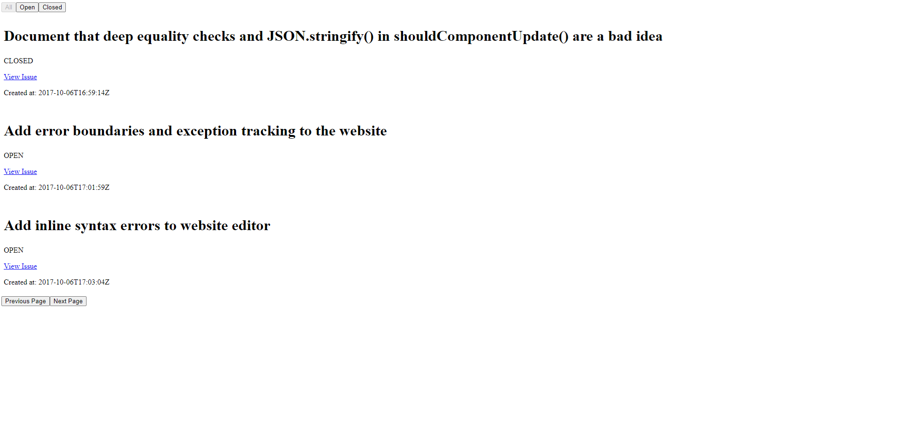
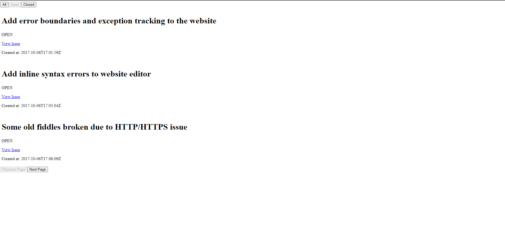
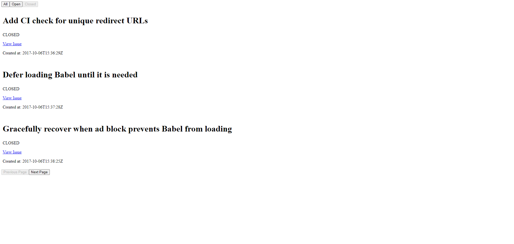

# Next.js GraphQL GitHub Issues

A simple web application built with Next.js to view GitHub issues using the GitHub GraphQL API. I used Apollo Client to fetch data from the API. I added Filter for ```all```-```open```-```closed``` issues and added a simple ```pagination```.

## Technologies Used

- **Next.js**
- **GitHub GraphQL API**
- **Apollo Client**
- **React**
- **TypeScript**

## Getting Started

### Prerequisites

- Node.js installed on your machine.

### Installation

1. Clone the repository:

   ```
   git clone https://github.com/Mylothros/github-issues-api.git
   npm install
   ```
2. Add your PAT
    
    Before running ```npm run dev``` you should add your PAT inside the ```.env.local``` file. After adding it just run ```npm run dev``` and your application is ready.

## Running tests
 ### Only tests for ```Filters.tsx``` have been added.
 To simply run the tests you can run ```npm test```.

# Presentation

## All issues with pagination on second page


## Open issues


## Closed issues
